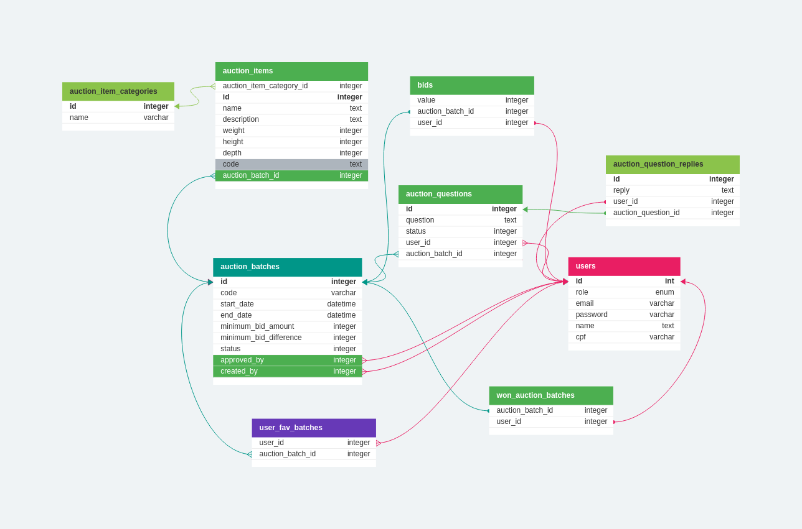

# Projeto de Leilão de Estoque para o Treinadev 10

Esta aplicação Ruby on Rails é uma aplicação web desenvolvida como parte do programa [Treinadev](https://treinadev.com.br/) 10, ela fornece uma maneira simples de gerenciar e lotes de leilão, seus itens, perguntas, imagens, lances e gerenciar usuários.

## Requisitos e Versões
* Ruby version: 3.2.1

* System dependencies: 
  - libvips 8.14.2-1 
  - openslide 3.4.1-4 

## Instalação e Configuração

Para começar a trabalhar com esta aplicação, siga estas etapas:

1.  Clone o projeto com `git clone` e entre na pasta do projeto para os próximos passos.

2. Instale o Ruby: Certifique-se de que você tenha o Ruby instalado em seu computador. Você pode verificar isso executando `ruby -v`. Se você não tiver o Ruby, você pode seguir [os guias de aprendizado do Ruby](https://guides.rubyonrails.org/getting_started.html).

3. Instale o Rails: Se ainda não instalou o Rails, siga o [guia de instalação oficial do Rails](https://guides.rubyonrails.org/getting_started.html).

4. Dentro da pasta do projeto, use o comando `bin/setup`, pois, ele fará as tarefas e configurações necessárias para rodar o projeto.

5. Por fim, pode usar o comando `bin/rails db:seed` para popular o banco de dados com dados de teste.

## Iniciando a Aplicação

 Use o comando `bin/dev` dentro da pasta do repositório para iniciar o servidor e acesse http://localhost:3000 para acessar a aplicação.

## Rodando testes com o RSpec

Existem três principais formas de executar os testes:

Usando o `rspec` para rodar todos os testes da forma padrão;

Usando o `rspec --format d` para rodar os testes no formato de documentação, mostrando todos os textos dos casos de teste;

Usando o `rspec --format p` para ver os testes na forma de progresso, sem o texto dos testes e apenas uma lista de pontos que representam cada caso de teste.

## Tarefas realizadas

- [x] Usuários Administradores
- [x] Cadastro de Itens para Leilão
- [x] Configuração de Lotes
- [x] Visualizar Lotes
- [x] Fazendo Lances
- [x] Validando Resultados
- [x] Verificando Lotes Vencidos
- [x] Bônus - Lotes Favoritos
- [x] Bônus - Dúvidas sobre um lote
- [x] Bônus - Bloqueio de CPFs
- [x] Bônus - Busca de Lotes e Itens
- [x] Feedback - Popular seeds

## Tarefas pendentes

- [ ] Extra - Testes de Request
- [ ] Feedback - Aumentar cobertura de testes para 99%
- [ ] Feedback - Melhorar nomenclatura de modelos e métodos
- [ ] Feedback - Padronizar o fronted
- [ ] Feedback - Consertar formulário onde não indica o que ocasionou a falha ao enviar
## Esquema do Banco de Dados Ilustrado

